<div align="center">

# HR4TREDENCE — HR Workflow Designer

**An Enterprise-Grade HR Workflow Modeler built with React, TypeScript, React Flow & Zustand.**

[](https://hr4tredence.netlify.app/)
[](https://react.dev)
[](https://typescriptlang.org)
[](https://tailwindcss.com)

*Designed & engineered by **Anket** for the Tredence Analytics AI Agentic Engineering Internship 2026.*

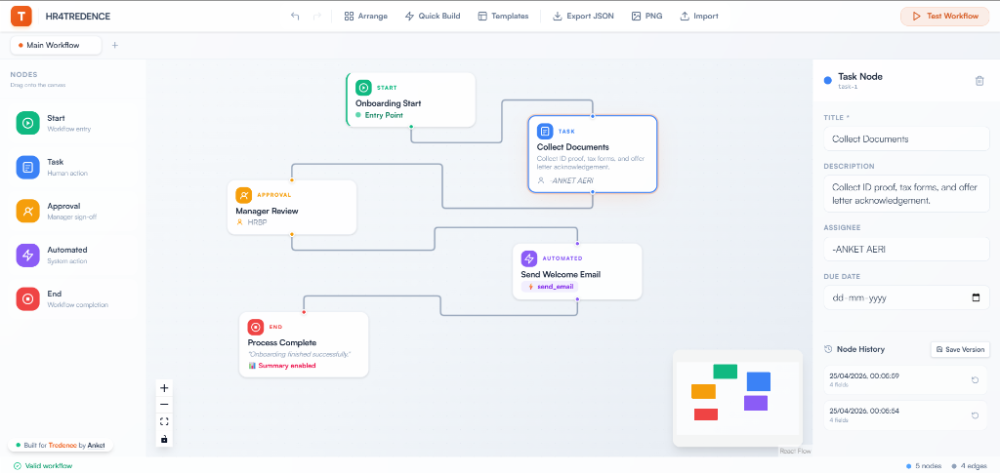
*HR4TREDENCE Canvas & Properties Panel — Complete with Real-Time Node Editing and Node Version History Tracking*

</div>

---

## 📋 Table of Contents

- [Live Demo](#-live-demo)
- [Quick Start](#-quick-start)
- [Features](#-features)
- [Architecture](#-architecture)
- [Design Decisions](#-design-decisions)
- [Tech Stack](#-tech-stack)

---

## 🌐 Live Demo

> **👉 [https://hr4tredence.netlify.app](https://hr4tredence.netlify.app/)**

Try it out — drag nodes from the sidebar, use the 40+ enterprise templates, review analytical insights, and execute simulations natively within the browser.

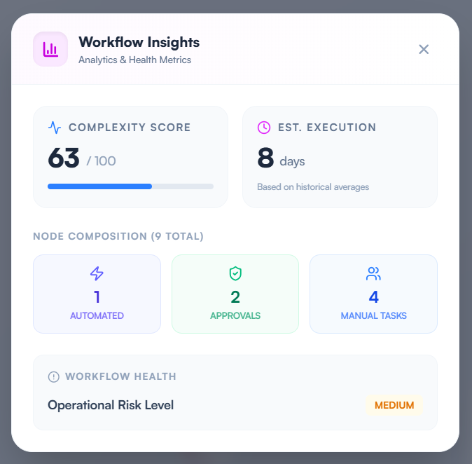
*Real-Time Workflow Health, Complexity Analytics, and Execution Estimates*

---

## 🚀 Quick Start

```bash
# Clone the repo
git clone https://github.com/anket08/hello-tredence-here-is-your-hr-flow.git
cd hello-tredence-here-is-your-hr-flow

# Install dependencies
npm install

# Start dev server
npm run dev
```

Open **[http://localhost:5173](http://localhost:5173)** in your browser.

---

## ✨ Features

### 🚀 Latest Major Release (v2.0 Updates)

The platform has been heavily upgraded to simulate a full enterprise-grade experience:
- **Massive Template Library**: 40+ highly complex, real-world HR templates (e.g., *M&A Integration*, *SOC2 Audits*, *RIF Process*) built-in.
- **Fuzzy Search Engine**: Instantly find specific templates with typo-tolerant, real-time searching in the Template Modal.
- **Workflow Insights AI**: A brand new analytics engine that scans your canvas and automatically generates Risk Scores, Execution Time Estimates, and Node Complexity Metrics.
- **Cinematic Auto-Layout**: The `Arrange` feature now perfectly cascades nodes using `dagre` and elegantly animates the canvas (`fitView`) to frame your new architecture perfectly.
- **Advanced Action Toolbar**: Redesigned top navigation featuring Quick Build, Templates, PNG High-Res Export, JSON I/O, Undo/Redo, and Fullscreen modes.
- **Clipboard Mechanics**: Seamlessly duplicate nodes across the canvas with native `Ctrl+C` and `Ctrl+V` support.
- **Dynamic Theming Engine**: Switch instantly between 6 professional themes (Tredence Default, Ocean Blue, Midnight Violet, Forest Green, Sunset Rose, Cyberpunk) with fully adaptive UI glassmorphism and node styling.
- **📱 Fully Mobile Responsive**: Access, view, and simulate your workflows on the go. The entire application (canvas, properties, modals) is meticulously optimized for touch screens and mobile displays.

### ⚙️ Core Capabilities

| Feature | Description |
| :--- | :--- |
| 🎨 **Drag & Drop Canvas** | Advanced interactive canvas with infinite pan, zoom, and minimap |
| 🧩 **Custom Workflow Nodes** | Start, Task, Approval, Automated Step, End — color-coded with dynamic icons |
| 📊 **Enterprise Insights** | Real-time analytics measuring workflow complexity, node composition, and operational risk |
| 📚 **Template Library** | 40+ real-world HR workflows (M&A, Relocation, SOC2) with real-time fuzzy searching |
| 🔗 **Intelligent Routing** | Connect and direct node paths; auto-arrange handles layout optimization |
| 🧪 **Execution Sandbox** | Run your workflow through the Tredence execution engine with live terminal logging |

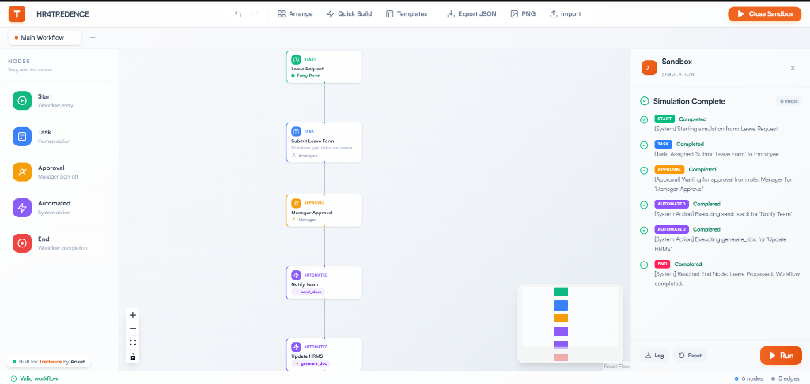
*Step-by-step Execution Engine and System Logs*

### Advanced Engineering Features

| Tool | Capability |
| :--- | :--- |
| 📐 **Smart Auto-Layout** | One-click `Dagre`-powered topological graph arrangement with automatic zoom-to-fit |
| 💾 **Node Versioning** | Save and rollback to previous field states for any individual node using "Node History" |
| ↩️ **Time-Travel State** | Full Undo / Redo stack tracking all destructive operations with `Ctrl+Z` / `Ctrl+Y` |
| 📥 **Import / Export** | Download the workspace as JSON and import existing blueprints |
| 📷 **High-Res Export** | Export the entire workflow as a high-resolution transparent PNG |
| ⚡ **Keyboard Shortcuts** | Full support for Duplicate (`Ctrl+D`), Copy/Paste (`Ctrl+C/V`), and Delete with dynamic Help modal |
| ⚠️ **Live Validation** | Amber badges instantly surface broken links or isolated nodes on the canvas |


*Fully-featured Application Toolbar*

### 🎨 Dynamic Theming Engine

The platform features a sophisticated global CSS custom property system that completely transforms the visual identity in real-time. Nodes, glassmorphic panels, and canvas elements fully adapt to both light and dark variations.

<div align="center">
  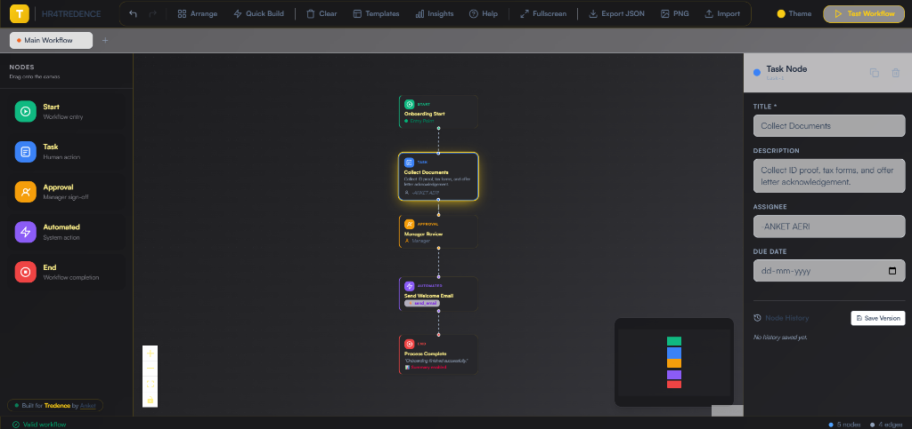
  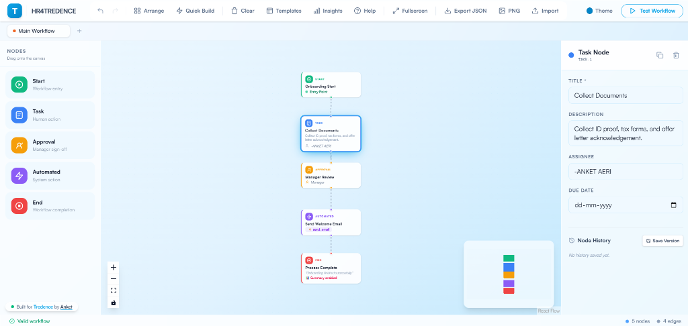
  <br/>
  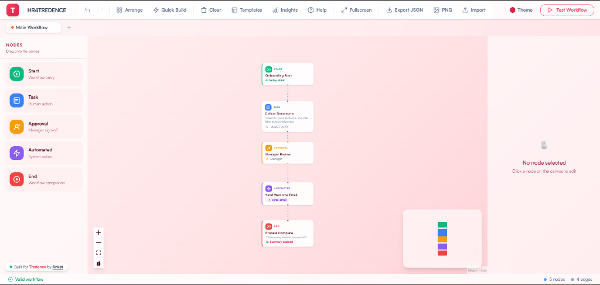
  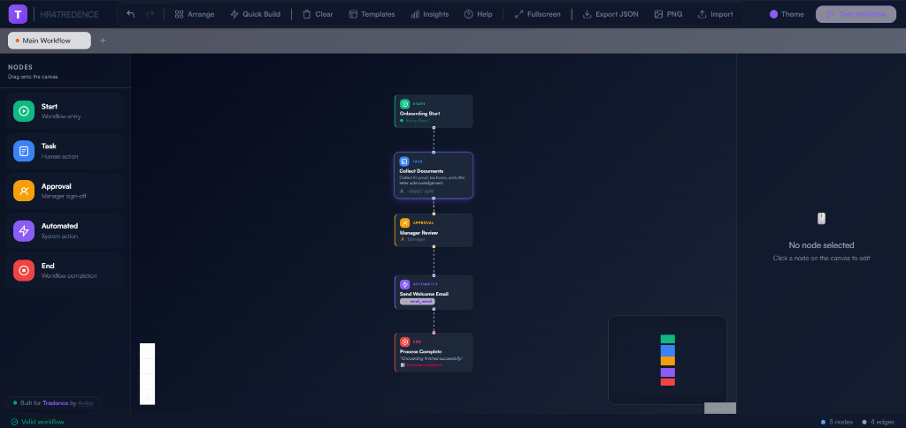
  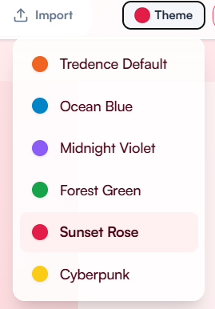
</div>

### 📱 Mobile Optimized Experience

The application is fully responsive, ensuring a seamless experience across all devices. The complex React Flow canvas, node property forms, and detailed insight modals fluidly adapt to mobile viewports.

<div align="center">
  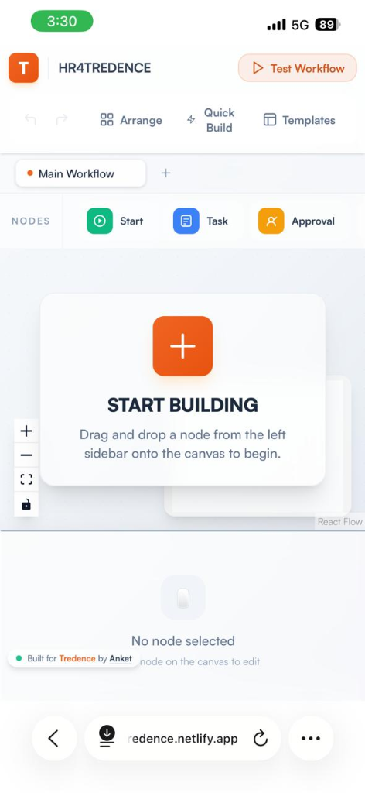
  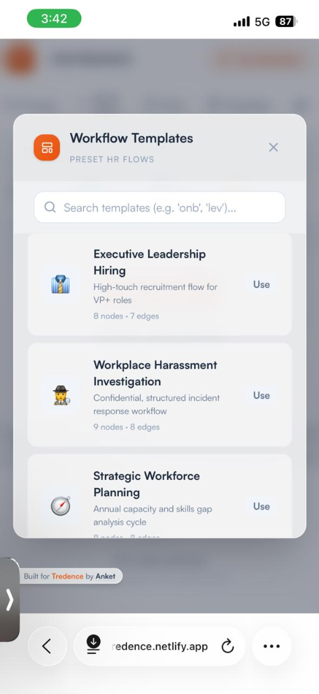
  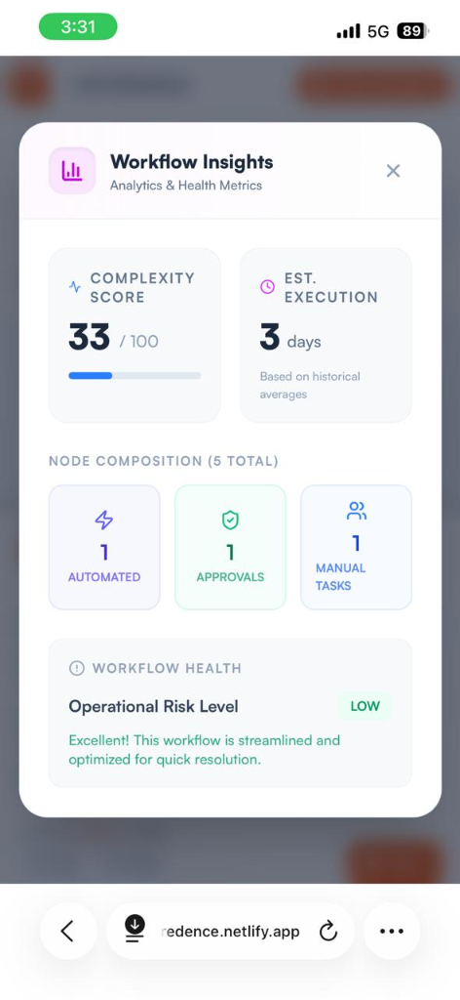
  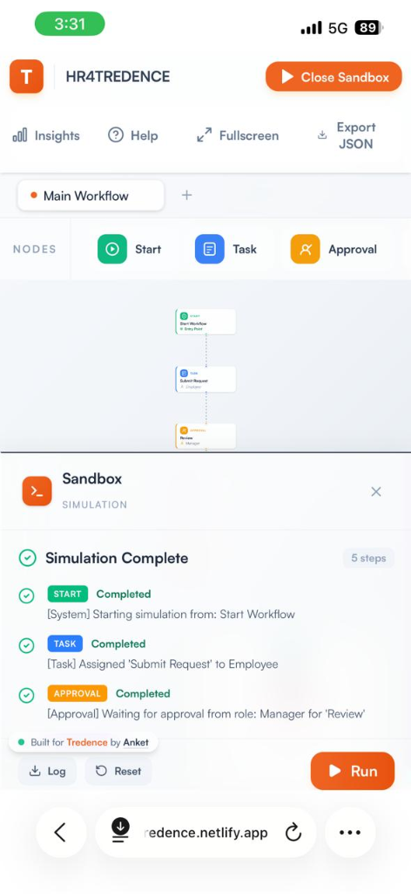
</div>

---

## 🏗️ Architecture

```text
src/
├── api/             # Mock REST layer (automations + simulate)
├── components/
│   ├── Canvas/      # React Flow wrapper — drag/drop, edge routing
│   ├── Nodes/       # Shared glassmorphic shells + 5 specific node types
│   ├── Properties/  # Right panel — dynamic forms + node versioning logic
│   ├── Sandbox/     # Modal — simulation execution engine + log viewer
│   ├── Sidebar/     # Left panel — draggable node palette
│   └── Templates/   # 40+ workflow blueprints with fuzzy matching
├── data/            # Hardcoded 40+ Enterprise templates (M&A, RTO, Harassment)
├── hooks/           # Memoized graph validation hook
├── store/           # Zustand — tabs, undo/redo, auto-layout, clipboard
├── utils/           # Dagre layout logic and structural validators
├── App.tsx          # Root layout + top application toolbar
└── index.css        # Glassmorphism, Satoshi typography, animations
```

---

## 🧠 Design Decisions

### Zustand for High-Performance State
React Flow triggers hundreds of events per second during drags. We use **Zustand with selector-subscriptions** to isolate re-renders. Component-level state remains pure, ensuring buttery-smooth 60fps performance even with complex graphs.

### Real-Time Validation & Insights
Validation isn't hidden in a menu. `useValidation()` memoizes structural integrity checks in real time, attaching amber warning badges directly to misconfigured nodes. The **Workflow Insights** modal computes operational risk dynamically based on task-to-approval ratios.

### Dagre Auto-Layout + Viewport Fit
Manually arranging 15+ nodes is tedious. The "Arrange" button feeds nodes to `dagre` for top-down directed graph layout, mutates their positions, and subsequently triggers a smooth React Flow `fitView` animation to re-center the canvas beautifully.

### Deep Desktop Integration
Added rich clipboard mechanics (`Ctrl+C`, `Ctrl+V`), global history undo/redo (`Ctrl+Z`), and full fullscreen toggles to elevate the application from a "web app" to a true "professional tool".

---

<div align="center">

*Hi there, TREDENCE team. I am the one u are looking 4.*

**[View Live Environment →](https://hr4tredence.netlify.app/)**

</div>