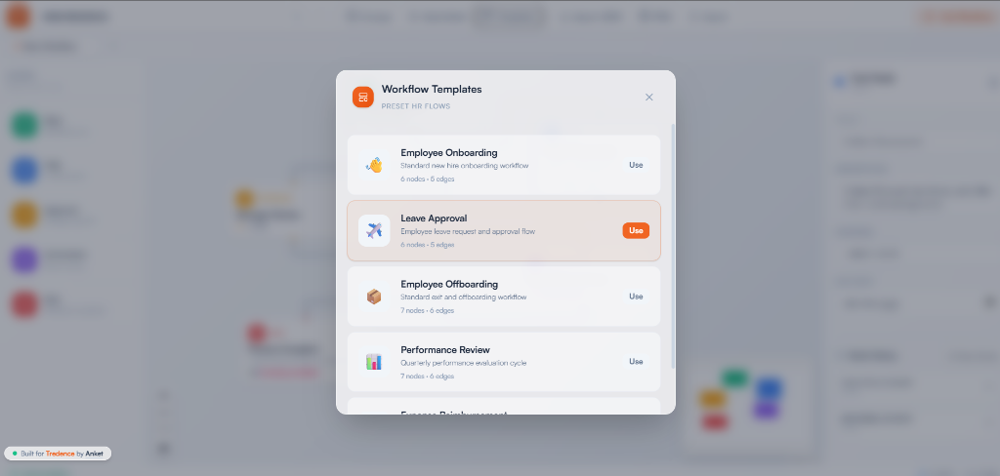

<div align="center">

# 🟠 Tredence Studio — HR Workflow Designer

**A single-page HR Workflow MVP Designer built with React, TypeScript, React Flow & Zustand.**

[](https://hr4tredence.netlify.app/)
[](https://react.dev)
[](https://typescriptlang.org)
[](https://tailwindcss.com)

*Designed & engineered by **Anket** for the Tredence Analytics AI Agentic Engineering Internship 2026.*


*HR4TREDENCE Canvas & Properties Panel (Note: You can save versions of each node and roll back to previous versions at any time)*

</div>

---

## 📋 Table of Contents

- [Live Demo](#-live-demo)
- [Quick Start](#-quick-start)
- [Features](#-features)
- [Architecture](#-architecture)
- [Design Decisions](#-design-decisions)
- [Tech Stack](#-tech-stack)
- [What I'd Add Next](#-what-id-add-next)
- [Assumptions](#-assumptions)

---

## 🌐 Live Demo

> **👉 [https://hr4tredence.netlify.app](https://hr4tredence.netlify.app/)**

Try it out — drag nodes from the sidebar, connect them, edit properties, run the simulation, and export your workflow as JSON.


*Ready-to-use Workflow Templates*

---

## 🚀 Quick Start

```bash
# Clone the repo
git clone https://github.com/anket08/hello-tredence-here-is-your-hr-flow.git
cd hello-tredence-here-is-your-hr-flow

# Install dependencies
npm install

# Start dev server
npm run dev
```

Open **[http://localhost:5173](http://localhost:5173)** in your browser.

---

## ✨ Features

### Core (Required)

| Feature | Description |
| :--- | :--- |
| 🎨 **Drag & Drop Canvas** | Drag node components from the sidebar onto a React Flow canvas |
| 🧩 **5 Custom Node Types** | Start, Task, Approval, Automated Step, End — each with distinct colors and icons |
| 📝 **Dynamic Property Forms** | Click any node to edit its fields — forms auto-switch based on node type |
| 🔗 **Edge Connections** | Connect nodes by dragging between handles; delete with keyboard |
| 🧪 **Simulation Sandbox** | Run your workflow through the Tredence mock execution engine |
| 📡 **Mock API** | `GET /automations` for action types, `POST /simulate` for execution logs |


*Real-time Simulation Execution Sandbox*

### Bonus (Implemented)

| Feature | Description |
| :--- | :--- |
| 📤 **Export JSON** | Download the current workflow as a `.json` file |
| 📥 **Import JSON** | Load any previously exported workflow back onto the canvas |
| ↩️ **Undo / Redo** | Full history stack with `Ctrl+Z` / `Ctrl+Y` keyboard shortcuts |
| 🗺️ **MiniMap + Zoom** | Interactive minimap and zoom controls on the canvas |
| ⚠️ **Validation on Nodes** | Amber warning badges appear directly on disconnected or misconfigured nodes |
| 📐 **Auto-Layout** | One-click Dagre-powered automatic node arrangement |
| 📑 **Multi-Tab Workflows** | Create, rename, and close workflow tabs — each tab is independent |
| 📋 **Download Sim Log** | Export simulation results as a `.txt` file |
| ⚡ **One-Click Sample** | Instantly load a full "Employee Onboarding" demo workflow |

---

## 🏗️ Architecture

```
src/
│
├── api/
│   └── mockApi.ts                # Mock REST layer (automations + simulate)
│
├── components/
│   ├── Canvas/
│   │   └── WorkflowCanvas.tsx    # React Flow wrapper — drag/drop, edges, selection
│   ├── Nodes/
│   │   ├── BaseNode.tsx          # Shared glassmorphic shell + validation badges
│   │   ├── StartNode.tsx         # 🟢 Green — entry point
│   │   ├── TaskNode.tsx          # 🔵 Blue — human task (assignee, due date)
│   │   ├── ApprovalNode.tsx      # 🟡 Amber — manager/HR approval
│   │   ├── AutomatedNode.tsx     # 🟣 Violet — system action (email, doc gen)
│   │   ├── EndNode.tsx           # 🔴 Red — completion node
│   │   └── index.ts              # Barrel export
│   ├── Properties/
│   │   └── PropertiesPanel.tsx   # Right panel — dynamic forms + delete button
│   ├── Sandbox/
│   │   └── SandboxPanel.tsx      # Modal — simulation engine + log viewer
│   ├── Sidebar/
│   │   └── Sidebar.tsx           # Left panel — draggable node palette
│   └── Tabs/
│       └── TabBar.tsx            # Tab bar — create, rename, switch, close
│
├── hooks/
│   └── useValidation.ts          # Memoized graph validation hook
│
├── store/
│   └── useStore.ts               # Zustand — tabs, undo/redo, auto-layout, import
│
├── types/
│   └── workflow.ts               # Strict TypeScript interfaces (discriminated unions)
│
├── utils/
│   ├── autoLayout.ts             # Dagre graph layout algorithm
│   └── validation.ts             # Structure validator (Start/End, connectivity, fields)
│
├── App.tsx                       # Root layout + toolbar
├── main.tsx                      # Entry point
└── index.css                     # Glassmorphism, Tredence theme, animations
```

---

## 🧠 Design Decisions

### Why Zustand?

React Flow fires hundreds of state updates during drag operations. Zustand's **selector-based subscriptions** ensure only affected components re-render — unlike Context, which would re-render the entire tree. The store is organized around a **tabs array**, with all canvas mutations scoped to the active tab through a shared `updateActiveTab()` helper.

### Why Glassmorphism?

The frosted-glass aesthetic (`backdrop-filter: blur()`) visually separates the three-panel layout (sidebar, canvas, properties) while keeping everything feel cohesive. Each node type has a **colored accent header** — making them instantly recognizable at a glance on a busy canvas.

### Node Architecture — Composition over Inheritance

All five node types **compose** a single `BaseNode` wrapper that handles:

- **Handle positioning** — Start = no target handle, End = no source handle
- **Selection glow** — orange-tinted shadow matching Tredence brand
- **Validation badges** — amber ⚠️ icon + inline error message
- **Glassmorphic shell** — shared border-radius, backdrop blur, shadow

> Adding a new node type = ~20 lines: one data interface + one component wrapping `BaseNode`.

### Real-Time Validation

The `useValidation()` hook runs a memoized `validateWorkflow()` on every node/edge change:

- ✅ Exactly one Start node
- ✅ At least one End node
- ✅ All mid-nodes have incoming + outgoing connections
- ✅ All nodes have non-empty titles

Errors appear as **amber badges directly on the affected canvas nodes** — not hidden in a log.

### Undo / Redo

A manual history stack (`history[]` + `historyIndex`) records snapshots before every destructive action (`addNode`, `deleteSelectedElements`, `onConnect`, `autoLayout`). The stack is capped at 50 entries. Keyboard shortcuts `Ctrl+Z` / `Ctrl+Y` are bound at the root element.

---

## 🛠️ Tech Stack

| Layer | Technology |
| :--- | :--- |
| **Framework** | React 18 + TypeScript (Vite) |
| **Flow Engine** | @xyflow/react (React Flow v12) |
| **State** | Zustand |
| **Graph Layout** | @dagrejs/dagre |
| **Styling** | Tailwind CSS v4 + custom glassmorphism CSS |
| **Icons** | Lucide React |
| **IDs** | uuid v11 |
| **Hosting** | Netlify |

---

## 🔮 What I'd Add Next

| Priority | Feature | Why |
| :---: | :--- | :--- |
| 1 | **Conditional branching** | Approval → "Approved" / "Rejected" output handles for non-linear flows |
| 2 | **Node version history** | Temporal snapshots per node using the existing history infra |
| 3 | **Preset templates** | One-click "Leave Approval", "Document Verification" partial workflows |
| 4 | **E2E tests** | Playwright coverage for drag-drop, forms, simulation, import/export |
| 5 | **Backend persistence** | FastAPI + PostgreSQL to save/list workflows per user |
| 6 | **Collaborative editing** | Zustand + Yjs for real-time multi-user design |

---

## 📝 Assumptions

- **Linear simulation** — The sandbox follows edges linearly from Start. Branching is architecturally supported but not simulated in the prototype.
- **No backend** — Export JSON serves as the save mechanism per the brief.
- **Single-page** — The entire designer lives on one page with no routing needed.
- **Glassmorphic UI** — Intentional design choice to demonstrate frontend polish. Requires modern browser with hardware-accelerated `backdrop-filter`.
- **Undo granularity** — Undo tracks destructive ops (add, delete, connect, layout). Node position drags are not individually tracked to avoid flooding the history stack.

---

<div align="center">

*Built with ❤️ for the Tredence Studio AI Agents Engineering team.*

**[View Live →](https://hr4tredence.netlify.app/)**

</div>
